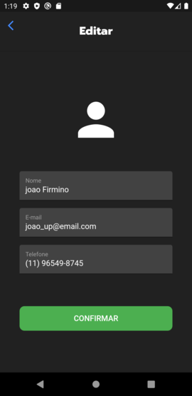
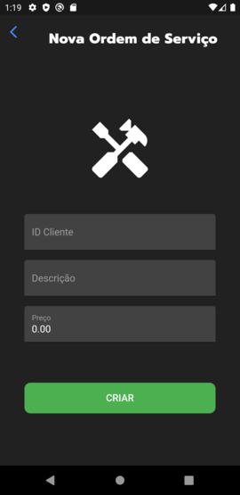

# client

Cliente API - Ordem de Serviço

## Getting Started

Projeto desenvolvido para a matéria de Aplicações Distribuídas (ADID6) do curso de Análise e Desenvolvimento de Sistemas do IFSP.

Telas:

  |  
  |  
  |  
  |  
  |  
